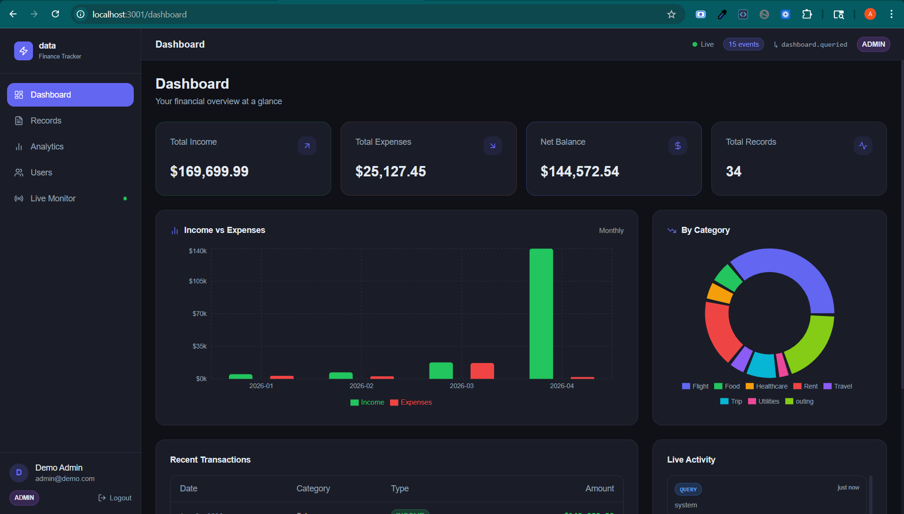

# Finance Dashboard API

A role-based finance management REST API built with **Node.js 20**, **TypeScript**, **Express**, **PostgreSQL** via Prisma ORM, and JWT authentication with RBAC.

---

## Table of Contents

1. [Feature Overview](#feature-overview)
2. [Tech Stack](#tech-stack)
3. [Quick Start](#quick-start)
4. [Environment Variables](#environment-variables)
5. [Database Setup](#database-setup)
6. [Running the Server](#running-the-server)
7. [Frontend (Testing UI)](#frontend-testing-ui)
8. [Password Policy](#password-policy)
9. [Role Matrix (RBAC)](#role-matrix-rbac)
10. [API Reference](#api-reference)
11. [Testing](#testing)
12. [Project Structure](#project-structure)
13. [Architecture Decisions](#architecture-decisions)
14. [Assumptions & Tradeoffs](#assumptions--tradeoffs)

---

## Feature Overview

| Requirement | Status | Notes |
|---|:---:|---|
| User and role management | ✅ | Create, list, update, deactivate users; roles: VIEWER / ANALYST / ADMIN |
| Financial records CRUD | ✅ | Create, read, update, soft-delete; amount stored as `Decimal(10,2)` |
| Record filtering & search | ✅ | Type, category, date range, amount range, free-text search, sort, paginate |
| Dashboard summary APIs | ✅ | Total income/expenses/net, by-category breakdown, trends, recent activity |
| Access control (RBAC) | ✅ | Enforced via `authorize` middleware; centralized `RoleError → 403` mapping |
| Input validation | ✅ | Zod schemas on every endpoint; 422 with per-field error array |
| Error handling | ✅ | Unified `errorHandler`; maps Zod / Prisma / JWT / domain errors |
| JWT authentication | ✅ | Access token (15 min) + refresh token rotation (7 days, SHA-256 hash in DB) |
| Soft delete | ✅ | Records: `isDeleted` flag; Users: `status = INACTIVE` |
| Pagination | ✅ | `page` + `limit` on all list endpoints |
| Rate limiting | ✅ | Global 100 req/15 min; auth routes 10 req/15 min |
| Real-time events (SSE) | ✅ | `GET /live/events` broadcasts record/user/auth events to subscribers |
| Integration tests | ✅ | 4 test suites, 40+ assertions; run against real PostgreSQL |
| API documentation | ✅ | Swagger UI at `GET /api/docs` |
| Structured logging | ✅ | Winston JSON logs + Morgan HTTP logs piped into Winston |

---

## Tech Stack

| Layer | Technology |
|---|---|
| Runtime | Node.js 20+ |
| Language | TypeScript 5 |
| Framework | Express.js |
| Database | PostgreSQL 14+ |
| ORM | Prisma 5 |
| Auth | JWT — access (15 min) + refresh (7 days, SHA-256 hashed in DB) |
| Validation | Zod |
| Logging | Winston (JSON/structured) + Morgan (HTTP) |
| Testing | Vitest + Supertest (real PostgreSQL, NOT SQLite) |
| Docs | swagger-jsdoc + swagger-ui-express at `GET /api/docs` |
| Security | helmet, cors, express-rate-limit |

---

## Quick Start

### Prerequisites

- Node.js 20+
- PostgreSQL 14+ running locally
- Two databases: `finance_dev` and `finance_test`

```sql
CREATE DATABASE finance_dev;
CREATE DATABASE finance_test;
```

### Steps

```bash
# 1. Install dependencies
npm install

# 2. Copy and configure env
cp .env.example .env
# Edit .env — set DATABASE_URL, TEST_DATABASE_URL, and both JWT secrets

# 3. Apply migrations
npm run db:migrate

# 4. Generate Prisma client
npm run db:generate

# 5. Seed demo data (optional but recommended)
npm run db:seed

# 6. Start dev server
npm run dev
```

API available at `http://localhost:3000/api` · Swagger docs at `http://localhost:3000/api/docs` · Health check at `http://localhost:3000/health`

---

## Environment Variables

| Variable | Required | Default | Description |
|---|---|---|---|
| `NODE_ENV` | No | `development` | Runtime environment (`development`, `production`, `test`) |
| `PORT` | No | `3000` | HTTP server port |
| `DATABASE_URL` | **Yes** | — | PostgreSQL connection string for the development/production database |
| `TEST_DATABASE_URL` | **Yes** (for tests) | — | PostgreSQL connection string for `finance_test` database |
| `JWT_ACCESS_SECRET` | **Yes** | — | Secret for signing access tokens (use ≥32 random chars) |
| `JWT_REFRESH_SECRET` | **Yes** | — | Secret for refresh token signing (use ≥32 random chars) |
| `JWT_ACCESS_EXPIRY` | No | `15m` | Access token lifetime |
| `JWT_REFRESH_EXPIRY` | No | `7d` | Refresh token lifetime |
| `ALLOWED_ORIGINS` | No | `http://localhost:3000` | Comma-separated CORS origins |
| `LOG_LEVEL` | No | `debug` | Winston log level (`error`, `warn`, `info`, `http`, `debug`) |

> All variables are validated at startup via Zod. Missing required variables cause `process.exit(1)`.

---

## Database Setup

```bash
# Apply all migrations
npm run db:migrate

# Regenerate Prisma client after schema changes
npm run db:generate

# Open Prisma Studio (visual DB browser)
npm run db:studio

# Seed demo data
npm run db:seed
```

Demo credentials after seeding:

| Role | Email | Password |
|---|---|---|
| ADMIN | admin@demo.com | Admin@123 |
| ANALYST | analyst@demo.com | Analyst@123 |
| VIEWER | viewer@demo.com | Viewer@123 |

> **Apply migrations to the test database before running tests:**
> ```bash
> DATABASE_URL=$TEST_DATABASE_URL npx prisma migrate deploy
> ```

---

## Running the Server

```bash
# Development (hot reload)
npm run dev

# Production
npm run build
npm start
```

---

## Frontend (Testing UI)

A companion **Next.js 14** frontend is included in the `frontend/` directory. It connects to this API and provides:

- A **login page** and protected dashboard layout with role-aware navigation.
- A **Live Events log panel** (powered by `GET /live/events` SSE) that displays real-time events — record creation, user actions, dashboard queries — as they happen, without any page refresh. This is the easiest way to observe the SSE broadcast system end-to-end during a demo or review.
- A **financial records table** with filtering controls wired to the `GET /records` query parameters.
- A **dashboard summary view** showing total income, expenses, net balance, and category breakdowns.

### Dashboard Preview



To run the frontend:

```bash
cd ../frontend
npm install
npm run dev
```

Frontend runs on `http://localhost:3001` by default. Ensure `ALLOWED_ORIGINS` in the backend `.env` includes `http://localhost:3001`.

---

## Password Policy

All passwords — at registration and when an admin creates a user — must satisfy:

| Rule | Example violation |
|---|---|
| Minimum 8 characters | `abc123` |
| At least one uppercase letter (`A-Z`) | `password@1` |
| At least one lowercase letter (`a-z`) | `PASSWORD@1` |
| At least one digit (`0-9`) | `Password@!` |
| At least one special character (non-alphanumeric) | `Password1` |

Passwords that fail these rules return HTTP **422** with a per-rule error message array.

---

## Role Matrix (RBAC)

### Role Definitions

| Role | Description |
|---|---|
| `VIEWER` | Read-only: can view records and basic dashboard summaries |
| `ANALYST` | Can create and update records; access advanced analytics |
| `ADMIN` | Full access: manage users, delete records, all analytics |

> **Bootstrap rule:** The very first registered user in an empty system is automatically assigned `ADMIN`. All subsequent `POST /auth/register` calls receive `VIEWER` by default. Additional roles must be assigned by an ADMIN via `PATCH /users/:id`.

### Permission Table

| Endpoint | VIEWER | ANALYST | ADMIN |
|---|:---:|:---:|:---:|
| `POST /records` | ❌ | ✅ | ✅ |
| `PATCH /records/:id` | ❌ | ✅ | ✅ |
| `GET /records` | ✅ | ✅ | ✅ |
| `GET /records/:id` | ✅ | ✅ | ✅ |
| `DELETE /records/:id` | ❌ | ❌ | ✅ |
| `GET /dashboard/summary` | ✅ | ✅ | ✅ |
| `GET /dashboard/recent` | ✅ | ✅ | ✅ |
| `GET /dashboard/by-category` | ❌ | ✅ | ✅ |
| `GET /dashboard/trends` | ❌ | ✅ | ✅ |
| `GET /users` | ❌ | ❌ | ✅ |
| `GET /users/:id` | ❌ | ❌ | ✅ |
| `POST /users` | ❌ | ❌ | ✅ |
| `PATCH /users/:id` | ❌ | ❌ | ✅ |
| `DELETE /users/:id` | ❌ | ❌ | ✅ |
| `GET /live/events` | ✅ | ✅ | ✅ |

> Unauthorized access returns HTTP **403** with `{ "success": false, "message": "Insufficient permissions" }`.

---

## API Reference

Interactive Swagger docs are available at **`GET /api/docs`** when the server is running.

### Base URL

```
http://localhost:3000/api
```

### Health Check

```
GET /health  →  200 { "success": true, "data": { "status": "ok", "timestamp": "..." } }
```

### Auth Endpoints

| Method | Path | Auth | Description |
|---|---|---|---|
| POST | `/auth/register` | ❌ | Register new user (first = ADMIN, subsequent = VIEWER) |
| POST | `/auth/login` | ❌ | Login — returns access + refresh token |
| POST | `/auth/refresh` | ❌ | Rotate refresh token, get new pair |
| POST | `/auth/logout` | ❌ | Invalidate refresh token |

### Records Endpoints

| Method | Path | Auth | Min Role |
|---|---|---|---|
| GET | `/records` | ✅ | VIEWER |
| GET | `/records/:id` | ✅ | VIEWER |
| POST | `/records` | ✅ | ANALYST |
| PATCH | `/records/:id` | ✅ | ANALYST |
| DELETE | `/records/:id` | ✅ | ADMIN |

**GET /records Query Parameters:**

| Param | Type | Description |
|---|---|---|
| `type` | `INCOME\|EXPENSE` | Filter by transaction type |
| `category` | string | Exact category match (case-insensitive) |
| `startDate` | ISO date | Records on or after this date |
| `endDate` | ISO date | Records on or before this date |
| `search` | string | Case-insensitive search on notes + category |
| `minAmount` | number | Minimum amount (inclusive) |
| `maxAmount` | number | Maximum amount (inclusive) |
| `page` | integer | Page number (default: 1) |
| `limit` | integer | Page size (default: 20, max: 100) |
| `sortBy` | `date\|amount` | Sort field (default: date) |
| `order` | `asc\|desc` | Sort direction (default: desc) |

### Dashboard Endpoints

| Method | Path | Auth | Min Role |
|---|---|---|---|
| GET | `/dashboard/summary` | ✅ | VIEWER |
| GET | `/dashboard/recent?limit=5` | ✅ | VIEWER |
| GET | `/dashboard/by-category` | ✅ | ANALYST |
| GET | `/dashboard/trends?period=monthly\|weekly` | ✅ | ANALYST |

### Users Endpoints

| Method | Path | Auth | Min Role |
|---|---|---|---|
| GET | `/users` | ✅ | ADMIN |
| GET | `/users/:id` | ✅ | ADMIN |
| POST | `/users` | ✅ | ADMIN |
| PATCH | `/users/:id` | ✅ | ADMIN |
| DELETE | `/users/:id` | ✅ | ADMIN |

**GET /users Query Parameters:**

| Param | Type | Description |
|---|---|---|
| `role` | `VIEWER\|ANALYST\|ADMIN` | Filter by role |
| `status` | `ACTIVE\|INACTIVE` | Filter by account status |
| `page` | integer | Page number (default: 1) |
| `limit` | integer | Page size (default: 20, max: 100) |

**POST /users body:**

```json
{ "name": "Alice", "email": "alice@co.com", "password": "Secure@123", "role": "ANALYST" }
```

`role` is optional and defaults to `VIEWER`. Password must satisfy the [password policy](#password-policy).

**PATCH /users/:id body** (all fields optional):

```json
{ "name": "Alice Smith", "role": "ANALYST", "status": "INACTIVE" }
```

**DELETE /users/:id** — soft-delete: sets `status = INACTIVE`. The user record is not removed from the database.

### Live Events (SSE)

| Method | Path | Auth | Min Role |
|---|---|---|---|
| GET | `/live/events?token=<accessToken>` | ✅ | VIEWER |

`EventSource` cannot send custom headers, so the access token is passed as the `token` query parameter. The server emits real-time Server-Sent Events whenever records, users, or auth actions occur.

**SSE Event Types:**

| Event type | Triggered by |
|---|---|
| `user.registered` | `POST /auth/register` or `POST /users` |
| `user.loggedIn` | `POST /auth/login` |
| `user.loggedOut` | `POST /auth/logout` |
| `user.roleChanged` | `PATCH /users/:id` |
| `user.deactivated` | `DELETE /users/:id` |
| `record.created` | `POST /records` |
| `record.updated` | `PATCH /records/:id` |
| `record.deleted` | `DELETE /records/:id` |
| `dashboard.queried` | Any `GET /dashboard/*` |

Each event has the shape:
```json
{
  "id": "uuid",
  "type": "record.created",
  "timestamp": "2026-04-03T10:00:00.000Z",
  "actor": { "id": "user-uuid" },
  "payload": { ... }
}
```

### Standard Response Envelopes

**Success (single resource):**
```json
{ "success": true, "data": { ... } }
```

**Success (list with pagination):**
```json
{
  "success": true,
  "data": {
    "records": [...],
    "pagination": { "total": 50, "page": 1, "limit": 20, "totalPages": 3 }
  }
}
```

**Error:**
```json
{ "success": false, "message": "Human-readable message" }
```

**Validation Error (422):**
```json
{ "success": false, "errors": [{ "field": "email", "message": "Invalid email address" }] }
```

### Error Code Mapping

| Error | HTTP Status |
|---|---|
| ZodError (validation) | 422 |
| Prisma P2025 (not found) | 404 |
| Prisma P2002 (duplicate) | 409 |
| Prisma P2003 (bad reference) | 400 |
| JWT TokenExpiredError | 401 |
| JWT JsonWebTokenError | 401 |
| RoleError (RBAC) | 403 |
| Everything else | 500 |

---

## Testing

### Setup Requirements

1. PostgreSQL must be running.
2. A database named `finance_test` must exist.
3. `TEST_DATABASE_URL` must be set in your `.env`.
4. Run migrations against the test database:
   ```bash
   DATABASE_URL=$TEST_DATABASE_URL npx prisma migrate deploy
   ```

### Why PostgreSQL for tests (not SQLite)?

`Prisma.Decimal` (used for `Decimal(10,2)` money fields) is incompatible with SQLite, which stores decimals as `REAL` floats. This would silently break decimal precision — e.g. `1500.00` becomes `1500.0000000001`. Tests run against real PostgreSQL to be production-equivalent. See [ASSUMPTIONS.md](./ASSUMPTIONS.md) for full rationale.

### Running Tests

```bash
# Run all tests once
npm test

# Watch mode (re-runs on file changes)
npm run test:watch

# Coverage report (output in ./coverage/)
npm run test:coverage
```

### Test Suites

| File | What's covered |
|---|---|
| `tests/auth.test.ts` | Register (first=ADMIN, second=VIEWER), weak-password rejection, login, refresh rotation, token invalidation after logout, inactive user block |
| `tests/users.test.ts` | VIEWER/ANALYST blocked (403), ADMIN full CRUD, `POST /users` (201/409/422), password field never returned, pagination |
| `tests/records.test.ts` | RBAC per role, soft-delete exclusion from list and `GET /:id`, all filter params (type/category/date/amount/search), decimal-as-string |
| `tests/dashboard.test.ts` | VIEWER access on summary/recent, VIEWER blocked on by-category/trends, sum correctness against seeded data, decimal-as-string on all monetary fields, trend grouping |

### Test Design Decisions

- **Isolation:** Tables are truncated in FK-safe order (`RefreshToken → FinancialRecord → User`) in `beforeEach` of each suite — every test starts from an empty DB.
- **Role setup:** Since `POST /auth/register` always makes the first user ADMIN, tests create users in the required order and promote roles via `testPrisma.user.update` where needed.
- **No mocking:** No stubs for Prisma or JWT — all integration paths run end-to-end.
- **Sequential execution:** Tests run in a single fork (`pool: forks, singleFork: true`) to avoid PostgreSQL connection contention.

---

## Project Structure

```
backend/
├── prisma/
│   ├── schema.prisma      # Data model: User, FinancialRecord, RefreshToken
│   ├── seed.ts            # Demo data — 3 users + 30 financial records
│   └── migrations/        # Prisma migration history
├── src/
│   ├── app.ts             # Express app — middleware, routes, error handler
│   ├── server.ts          # HTTP server entry point
│   ├── config/
│   │   ├── env.ts         # Zod-validated env — process.exit(1) if invalid
│   │   ├── db.ts          # Prisma singleton
│   │   ├── logger.ts      # Winston instance + Morgan stream
│   │   └── swagger.ts     # swagger-jsdoc configuration
│   ├── middlewares/
│   │   ├── authenticate.ts  # JWT verification → req.user
│   │   ├── authorize.ts     # Role factory → RoleError → 403
│   │   ├── validate.ts      # validateBody/validateQuery Zod wrappers
│   │   ├── errorHandler.ts  # Unified error → HTTP status mapping
│   │   └── rateLimiter.ts   # Global 100/15min + Auth 10/15min
│   ├── modules/
│   │   ├── auth/            # Register, Login, Refresh, Logout
│   │   ├── users/           # ADMIN-only user management
│   │   ├── records/         # Financial records CRUD + filters
│   │   ├── dashboard/       # Aggregation: summary, by-category, trends, recent
│   │   └── live/            # SSE broadcast service + routes
│   ├── utils/
│   │   ├── asyncHandler.ts  # Wraps async controllers — forwards errors to next()
│   │   ├── response.ts      # success() / error() response envelope builders
│   │   └── crypto.ts        # bcrypt + SHA-256 refresh token hash helpers
│   └── types/
│       ├── express.d.ts     # Express Request augmentation (req.user)
│       └── index.ts         # Shared enums + interfaces
└── tests/
    ├── setup.ts             # beforeEach truncate (FK-safe), afterAll disconnect
    ├── auth.test.ts
    ├── users.test.ts
    ├── records.test.ts
    └── dashboard.test.ts
```

---

## Architecture Decisions

- **Route → Controller → Service → Repository → Prisma** — strict four-layer architecture. Each layer has one responsibility; no layer skips another.
- **No try/catch in controllers** — all async handlers wrapped in `asyncHandler(fn)`, errors forwarded to the unified `errorHandler` via `next(err)`.
- **No Prisma in services** — all DB access is delegated to the repository layer; services contain only business logic.
- **No business logic in controllers** — controllers only parse the request and send the response.
- **Decimal amounts serialized as strings** — `Prisma.Decimal` is converted via `.toFixed(2)` before leaving the service layer. JSON serialisation of a raw `Decimal` would lose precision silently.
- **Password excluded at query level** — every repository method uses an explicit `select` object that omits the `password` field. It is never stripped in the service layer.
- **Refresh token security** — the raw 128-bit token is never stored. Only its SHA-256 hex hash is persisted. The raw token is invalidated and re-issued on every use (rotation).
- **Soft delete, not hard delete** — financial records use an `isDeleted` flag; users use `status = INACTIVE`. Both approaches preserve the audit trail while hiding data from normal queries.
- **SSE events are best-effort** — the `liveService.emit()` call never throws; failed writes to a disconnected client silently remove it from the subscriber set.

---

## Assumptions & Tradeoffs

All decisions that deviate from or extend the specification are documented below. Each entry explains the reason for the choice and the alternative that was considered and rejected.

| # | Decision | Reason | Alternative & Why Rejected |
|---|---|---|---|
| 1 | **PostgreSQL for test DB** instead of SQLite | `Prisma.Decimal` (`Decimal(10,2)`) is incompatible with SQLite — it silently converts to `REAL` float, breaking the decimal precision contract (e.g. `1500.00` → `1500.0000000001`) | Separate SQLite schema — rejected; schema drift risk and maintenance overhead |
| 2 | **Refresh token = `crypto.randomBytes(64).toString('hex')`** (128-bit) | Higher entropy than `crypto.randomUUID()` (36-char UUID). Spec allowed either; chose the safer option | `crypto.randomUUID()` — viable but lower entropy |
| 3 | **`vitest.config.ts` with `envFile: '.env'`** | Vitest does not auto-load `.env`; without this, `TEST_DATABASE_URL` and JWT secrets are undefined at test time | `dotenv` call inside `setup.ts` — rejected; produces side-effects during module loading |
| 4 | **Morgan HTTP logs piped into Winston** via custom write stream | Keeps all structured logs in one sink; Morgan's `stream` option accepts any `{ write(s: string) }` object | Separate morgan log file — rejected; spec calls for Winston integration |
| 5 | **`PATCH /users/:id` updates `name`, `role`, `status` only** | Email changes require uniqueness re-validation; password changes require re-hashing + its own flow. Both are separate concerns from a generic patch | Full user update in one endpoint — rejected, over-engineering the patch surface |
| 6 | **`GET /records/:id` returns 404 for soft-deleted records** | Consistent with the list exclusion rule; returning a record with `isDeleted: true` would leak internal state to the caller | Return the record with the flag exposed — rejected; violates principle of least information |
| 7 | **Rate limiter uses `standardHeaders: true, legacyHeaders: false`** | `express-rate-limit` v7 defaults; emits `RateLimit-*` headers per RFC 6585 draft instead of deprecated `X-RateLimit-*` | Legacy headers — rejected; deprecated in v7 |
| 8 | **Seed script runs via `ts-node`** (no compile step) | Seed file is TypeScript; compiling it separately before seeding is an unnecessary extra step in the DX workflow | Pre-compile seed — rejected; adds friction |
| 9 | **`testTimeout: 30000` in vitest config** | Supertest + Prisma against a real PostgreSQL instance on CI can exceed the default 5 s timeout, causing flaky failures | Default 5 s — rejected; reproducibly fails on slower machines |
| 10 | **`authorize` throws `RoleError` (custom class)** instead of responding inline | The unified `errorHandler` maps `RoleError → 403`; throwing keeps controllers free of auth response logic and maintains the no-try/catch convention | `res.status(403).json()` inline in middleware — rejected; bypasses the unified error pipeline |
| 11 | **Dashboard trends use `$queryRaw` with `DATE_TRUNC`** (PostgreSQL native) | `DATE_TRUNC` is the correct PostgreSQL primitive for period aggregation; Prisma's `groupBy` cannot group by a computed date expression | `groupBy` + JavaScript post-processing — rejected; requires fetching all rows into memory |
| 12 | **`eslint` declared in `devDependencies` but no `.eslintrc` generated** | The `lint` npm script is present; declaring the package prevents the script from failing if invoked. Full ESLint config is out of scope for the assignment | Omit `eslint` entirely — rejected; the script would throw a command-not-found error |
